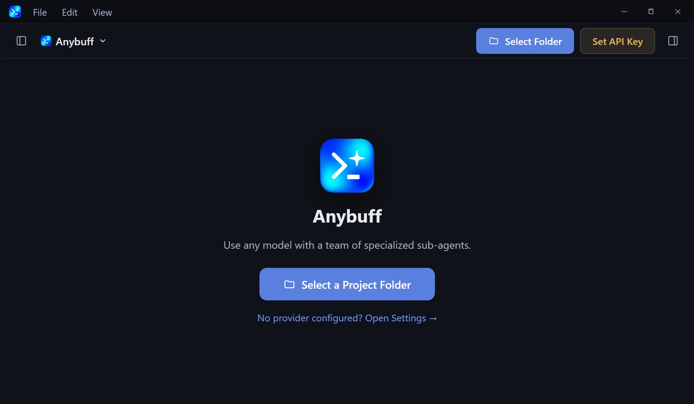

# Anybuff

[English](./README.md) | [繁體中文](./README.zh-TW.md)

**A bring-your-own-key (BYOK) coding agent for Windows**, built on the
[Freebuff](https://github.com/CodebuffAI/freebuff) multi-agent architecture.

Anybuff runs the Freebuff agent runtime **entirely in-process** — no hosted
backend, no ads, no credits. You connect your own OpenAI-compatible or
Anthropic-compatible endpoints — cloud APIs (OpenAI, Anthropic, Mistral,
DeepSeek, GLM, OpenRouter …) or fully local ones (Ollama, LM Studio, vLLM) —
and pay your providers directly.

```
┌─────────────────────────── Anybuff Desktop ───────────────────────────┐
│  Electron + React 19 UI  │  main process embeds @codebuff/sdk         │
│  chat · diff · agents    │  agent-runtime · tools · BYOK model layer  │
└──────────────────────┬─────────────────────────────────────────────────┘
                       │ apiKeyOverrides channel (never process.env)
              anybuff.json provider routing (modes → agents → default)
                       │
        Your providers: OpenAI-compatible / Anthropic-compatible
```

## Screenshot



The welcome screen: pick a project folder, connect any OpenAI-compatible or
Anthropic-compatible provider, and start chatting.

## Quick start

1. Download **`AnyBuff-Setup-<version>.exe`** (currently **v0.1.0-beta.3**)
   from the
   [latest release](https://github.com/JasonMMIV/Anybuff/releases/latest) and
   run it. The installer is unsigned, so SmartScreen shows "Unknown publisher"
   — click *More info → Run anyway*. (See the welcome screen above.)
2. Pick a project folder (try `desktop/demo-project`), open Settings,
   add a provider (baseURL + API key — keys are DPAPI-encrypted via Electron
   safeStorage), fetch models, select one, and start chatting.

## Security

The provider keys stored in Anybuff's settings are DPAPI-encrypted at rest.
This does **not** extend to files inside your projects — keep unencrypted
credentials (`.env`, `*.pem`, `*.key`, `id_rsa`, `kubeconfig`, …) out of any
project you open.

## Repository layout

| Path | Purpose |
|---|---|
| `desktop/` | Electron app (main / preload / renderer), ported from a prior prototype and adapted to the workspace SDK |
| `sdk/` | `@codebuff/sdk` — in-process agent runtime with the Anybuff BYOK layer (`provider-config.ts`, `impl/model-provider.ts`, failover/retry, followups policy, env sanitization) |
| `packages/agent-runtime` | Upstream step engine (untouched) |
| `packages/llm-providers` | Vendored AI-SDK v7 openai-compatible provider + grafted interop features |
| `common/` | Upstream shared types/tools/contracts (+ local-mode constants) |
| `agents/` | Upstream agent templates; model strings are *routing keys* resolved through anybuff.json |
| `scripts/generate-desktop-agents.ts` | Regenerates `desktop/src/main/agents/bundled-agents.ts` from upstream `agents/` with desktop patches baked in |
| `cli/` | Upstream CLI source kept on disk but OUT of the build graph (v2 candidate) |

## Key behaviors

- **suggest_followups disabled by default** (`ANYBUFF_FOLLOWUPS=1` re-enables).
- **context-pruner activity hidden** in the desktop UI (still runs; zero LLM).
- **web_search** is a local DuckDuckGo implementation with SSRF guards — no key, no backend.
- Provider compat rules are data-driven and strip-only (never suppress reasoning);
  observability under `[anybuff-compat]`.
- API keys: DPAPI-encrypted at rest, delivered to the SDK through an injection
  channel, scrubbed from every child-process environment.
- Atomic config/checkpoint writes (fsync, rename-replace, never pre-delete).

## Development

For contributors building from source (end users only need the installer):

```powershell
bun run build:sdk        # rebuild SDK after touching sdk/, packages/, common/
bun --cwd desktop run typecheck
cd desktop && bun test src/__tests__          # or package-local suites
bun scripts/smoke-sdk.ts # headless end-to-end BYOK check (needs a real key)
```

Upstream sync: internal packages keep their `@codebuff/*` names on purpose so
`git merge` from CodebuffAI/freebuff stays viable.

## License

Apache-2.0 (inherited from upstream Freebuff/Codebuff). See LICENSE and NOTICE.
